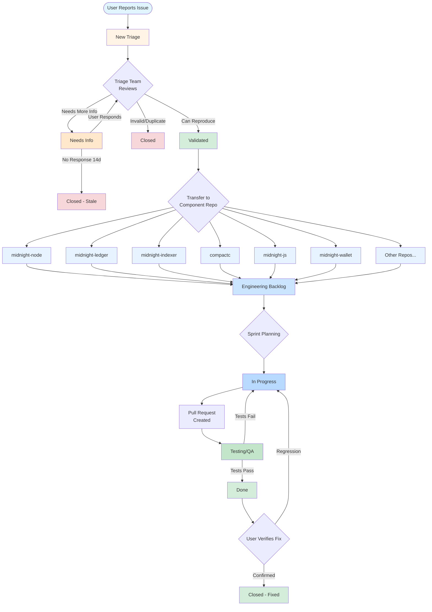
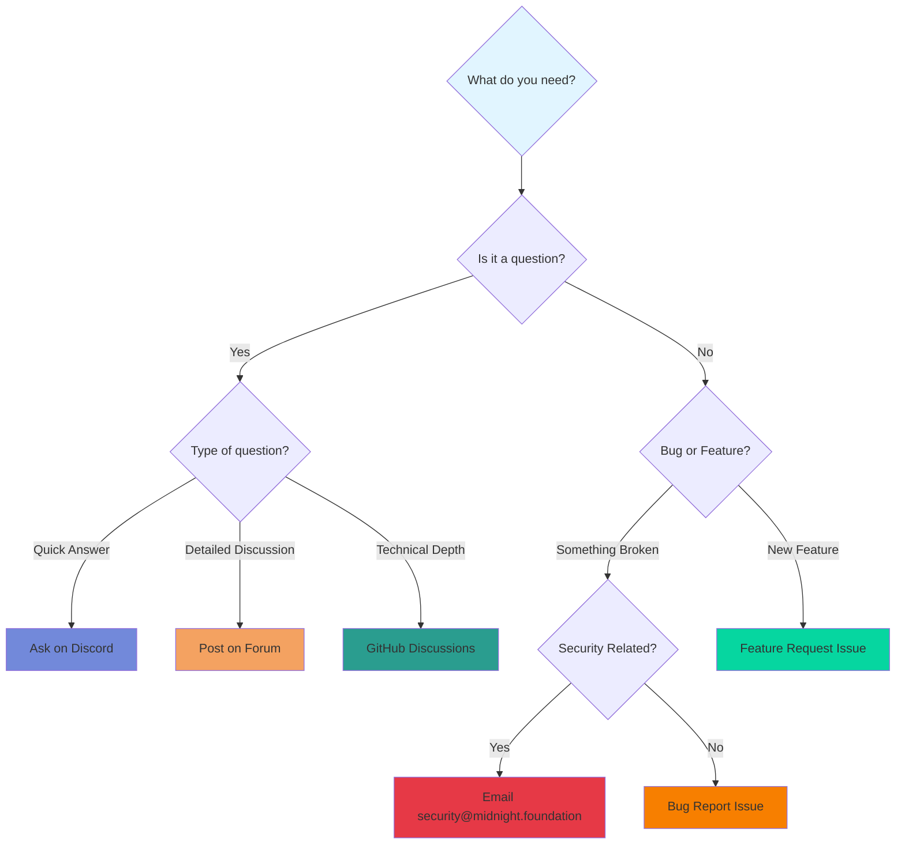

# Midnight Foundation- Issues & Bug Tracking

Welcome to the Midnight Network issue tracking repository! This is the central hub for reporting bugs, requesting features, and getting support for the entire Midnight blockchain ecosystem.

## 📋 Table of Contents

- [About This Repository](#about-this-repository)
- [How to Report an Issue](#how-to-report-an-issue)
- [Issue Lifecycle](#issue-lifecycle)
- [Component Overview](#component-overview)
- [What to Include](#what-to-include)
- [Priority & Severity Guidelines](#priority--severity-guidelines)
- [Security Issues](#security-issues)
- [Getting Help](#getting-help)

---

## 🎯 About This Repository

This repository serves as the **single entry point** for all code related issues across the Midnight ecosystem. You don't need to know which internal repository handles your issue - our triage team will route it to the right place. If you do know, then please, by all means, help us accelerate the process. 

## The Support Board
SETUP BOARD AND REPLACE (TODO)
The [Support Board](https://github.com/orgs/midnightntwrk/projects/33) provides a Kanban based view of tickets opened and faciliates the triage process. 

---

## 🐛 How to Report an Issue

### Step 1: Search Existing Issues

Before creating a new issue, please [search existing issues](../../issues) to avoid duplicates. Someone may have already reported the same problem!

### Step 2: Choose the Right Template

Click **"New Issue"** and select the appropriate template:

- **🐛 Bug Report** - For reporting bugs and unexpected behavior
- **✨ Feature Request** - For suggesting new features or improvements
- **📚 Documentation** - For documentation issues or improvements
- **❓ Question** - For general questions and support

### Step 3: Fill Out the Template

Provide as much detail as possible. The more information you give us, the faster we can help!

**Essential information includes:**
- Clear description of the issue
- Steps to reproduce
- Expected vs actual behavior
- Your environment (OS, versions, network)
- Logs and error messages

### Step 4: Submit and Track

Once submitted, your issue will:
1. Appear in the **"New Triage"** column on our project board
2. Be reviewed by our triage team within 1-3 business days
3. Get routed to the appropriate component repository
4. Be assigned to the relevant engineering team

You'll receive notifications at each stage and can track progress on the GitHub Projects board.

---

## 🔄 Issue Lifecycle

Here's how your issue moves through our system:

### Lifecycle Stages Explained

| Stage | Description | Typical Duration |
|-------|-------------|------------------|
| **New Triage** | Issue just submitted, awaiting triage team review | 1-3 business days |
| **Needs Info** | Triage team needs more details from reporter | Until user responds (auto-close after 14 days) |
| **Validated** | Bug confirmed and ready to be routed to component team | 1-2 days |
| **Transferred** | Issue moved to appropriate component repository | Immediate |
| **Engineering Backlog** | In component team's backlog, awaiting sprint planning | Varies by priority |
| **In Progress** | Engineer actively working on the fix | 1-2 weeks (varies) |
| **Testing/QA** | Fix merged, undergoing quality assurance | 2-5 days |
| **Done** | Fix verified and released | - |
| **Closed** | Issue resolved or determined invalid | - |

---

## 🧩 Component Overview

The Midnight ecosystem consists of multiple interconnected components. You don't need to know which one is affected - our triage team will figure that out! But here's an overview for reference:

### Blockchain Infrastructure

| Component | Description | Common Issues |
|-----------|-------------|---------------|
| **Node** (`midnight-node`) | Consensus, runtime, RPC server | Node crashes, sync issues, RPC errors |
| **Ledger** (`midnight-ledger`) | Transaction processing, state management | Transaction failures, state inconsistencies |
| **Indexer** (`midnight-indexer`) | Block indexing, GraphQL API | Missing data, query errors, slow performance |
| **ZK Proofs** (`midnight-zk`) | Circuit implementation, proof system | Proof verification failures, circuit errors |
| **Proof Server** | ZK proof generation service | Timeouts, OOM errors, slow proof generation |

### Smart Contracts & Compilation

| Component | Description | Common Issues |
|-----------|-------------|---------------|
| **Compact Compiler** (`compactc`) | Smart contract language compiler | Compilation errors, type errors, ZKIR issues |
| **ZKIR** | Zero-knowledge intermediate representation | Circuit generation issues |
| **Contract Runtime** | On-chain execution environment | Runtime errors, gas issues, execution failures |

### Application Layer

| Component | Description | Common Issues |
|-----------|-------------|---------------|
| **Midnight.js SDK** | TypeScript application framework | API errors, integration issues, type definitions |
| **Wallet SDK** (`midnight-wallet`) | Wallet operations and key management | Balance errors, transaction building, key derivation |
| **DApp Connector API** | Application integration layer | Connection issues, authorization problems |
| **Faucet** | Token distribution service | Faucet failures, rate limiting issues |

### Interoperability

| Component | Description | Common Issues |
|-----------|-------------|---------------|
| **Partner Chains** | Cardano integration toolkit | Bridge sync issues, cross-chain failures |
| **Bridge Contracts** | Cross-chain operations | Asset transfer issues, lock/unlock problems |

### Infrastructure

| Component | Description | Common Issues |
|-----------|-------------|---------------|
| **Documentation** (`midnight-docs`) | Developer documentation | Outdated docs, missing examples, typos |
| **Deployment** (`midnight-charts`) | Kubernetes/Helm charts | Deployment failures, configuration issues |
| **Metrics & Monitoring** | Observability tooling | Missing metrics, monitoring gaps |
| **Build System** | Nix, Cargo, Yarn, Earthly | Build failures, dependency issues |

---

## 📝 What to Include

The more information you provide, the faster we can resolve your issue!

### For Bug Reports

#### Required Information:
- ✅ **Clear description** of what went wrong
- ✅ **Steps to reproduce** the issue (numbered list)
- ✅ **Expected behavior** vs **actual behavior**
- ✅ **Environment details**: OS, versions, network (testnet/devnet)
- ✅ **Component** you think is affected (best guess is fine!)

#### Helpful Additional Information:
- 📋 **Logs and error messages** (full stack traces)
  - For Rust: Include `RUST_BACKTRACE=1` output
  - For TypeScript: Include full stack trace
  - For Compact: Include compiler output and ZKIR dumps
- 📸 **Screenshots or screen recordings**
- 🔧 **Build environment**: Nix, Docker, or native build
- 🌐 **Network**: Which network (mainnet/testnet/devnet/localnet)
- 📦 **Versions**:
  - Node: `midnight-node --version`
  - SDK: Check `package.json`
  - Compiler: `compactc --version`

### For Feature Requests

- 🎯 **Clear use case**: What problem does this solve?
- 💡 **Proposed solution**: How should it work?
- 🔀 **Alternatives considered**: Other approaches you've thought about
- 🎨 **Examples**: Similar features in other systems
- 📊 **Impact**: Who benefits and how much?

### For Documentation Issues

- 📄 **Document location**: Link or path to the doc
- ❌ **What's wrong**: Describe the issue
- ✅ **Suggested fix**: How to improve it
- 💡 **Additional context**: Why this matters

---

## 🚨 Priority & Severity Guidelines

Help us prioritize by selecting the appropriate severity:

### 🔴 Critical
**Response Time: Same day**

**NOTE: ALL Critical issues require synchronous notification and acknowledgement. Creating a github issue is necessary but not sufficient.** 

Examples:
- Chain halt or consensus failure
- Data loss or corruption
- Security vulnerabilities
- Complete service outage

When to use:
- System is unusable
- Data integrity at risk
- Security breach or exploit
- Affects all users

### 🟠 High
**Response Time: 1-2 business days**

Examples:
- Major feature completely broken
- Transaction failures affecting multiple users
- Proof generation consistently failing
- API endpoint returning errors

When to use:
- Core functionality broken
- No workaround available
- Significantly impacts users
- Blocks development work

### 🟡 Medium
**Response Time: 3-5 business days**

Examples:
- Feature works but has significant limitations
- Performance degradation
- Workaround exists but is cumbersome
- Errors that can be recovered from

When to use:
- Feature partially works
- Workaround available
- Impacts some users
- Non-blocking for critical work

### 🟢 Low
**Response Time: 1-2 weeks**

Examples:
- Minor UI issues
- Cosmetic problems
- Documentation typos
- Nice-to-have improvements

When to use:
- Minimal impact
- Edge cases
- Cosmetic issues
- Optional enhancements

---

## 🔒 Security Issues

**⚠️ IMPORTANT: Do NOT report security vulnerabilities in this public repository!**

If you've discovered a security vulnerability:

1. **Email the foundation security email privately**: security@midnight.foundation
2. **Include**:
   - Description of the vulnerability
   - Steps to reproduce
   - Potential impact
   - Your contact information
3. **Follow responsible disclosure**: Give us time to fix before public disclosure
4. **Check SECURITY.md**: See the MNF full security policy in individual component repos

We take security seriously and will respond promptly to all reports.

---

## 🆘 Getting Help

### Before Opening an Issue

1. **Check Documentation**: [Midnight Docs](https://docs.midnight.network)
2. **Search Existing Issues**: Someone may have already asked!
3. **Review FAQs**: Common questions and answers
4. **Check Status Page**: Known outages and maintenance

### Issue Type Decision Tree

### Response Times

| Issue Type | First Response | Resolution Target |
|-----------|----------------|-------------------|
| Critical | < 4 hours | 1-2 days |
| High | < 1 business day | 3-7 days |
| Medium | < 3 business days | 2-4 weeks |
| Low | < 1 week | Best effort |

*Note: These are targets, not guarantees. Complex issues may take longer.*

---

## 🤝 Contributing

Want to help? Here's how:

- **Report bugs** you encounter - every report helps!
- **Verify fixes** when we ask - confirm the issue is resolved
- **Help others** by commenting on issues you've experienced
- **Improve documentation** when you find gaps
- **Submit PRs** to the relevant component repositories

See our [CONTRIBUTING.md](./CONTRIBUTING.md) for detailed guidelines.

---

## 📊 Issue Statistics

Track our progress on the [Project Board](../../projects/1)!

**Current Status:**
- 📥 New Triage: Issues awaiting review
- ⏳ Needs Info: Waiting for reporter feedback
- ✅ Validated: Confirmed and ready for routing
- 🔧 In Progress: Actively being worked on
- ✔️ Done: Resolved in latest release

---

## 🏷️ Labels Reference

Our labeling system helps organize and route issues:

### Component Labels
`comp:node` `comp:ledger` `comp:indexer` `comp:zk` `comp:compiler` `comp:sdk-js` `comp:wallet` `comp:proof-server` `comp:faucet` `comp:partner-chains` `comp:docs`

### Type Labels
`type:bug` `type:feature` `type:docs` `type:performance` `type:security` `type:build` `type:test` `type:question`

### Severity Labels
`sev:critical` `sev:high` `sev:medium` `sev:low`

### Priority Labels
`priority:critical` `priority:high` `priority:medium` `priority:low`

### Status Labels
`status:triage` `status:validated` `status:blocked` `status:in-progress` `status:needs-info` `status:duplicate` `status:wontfix`

### Area Labels
`area:consensus` `area:rpc` `area:storage` `area:crypto` `area:compilation` `area:runtime` `area:api` `area:cli` `area:ui` `area:performance`

### Language Labels
`lang:rust` `lang:typescript` `lang:scheme` `lang:compact`

### Network Labels
`network:mainnet` `network:testnet` `network:devnet` `network:localnet`

---

## 📞 Contact

- **General Issues**: Open an issue in this repository
- **Security Issues with this repositori**: security@midnight.foundation
---

## 📄 License

This repository is for issue tracking only. The actual Midnight codebase is licensed under Apache License 2.0. See individual component repositories for their specific license files.

---
