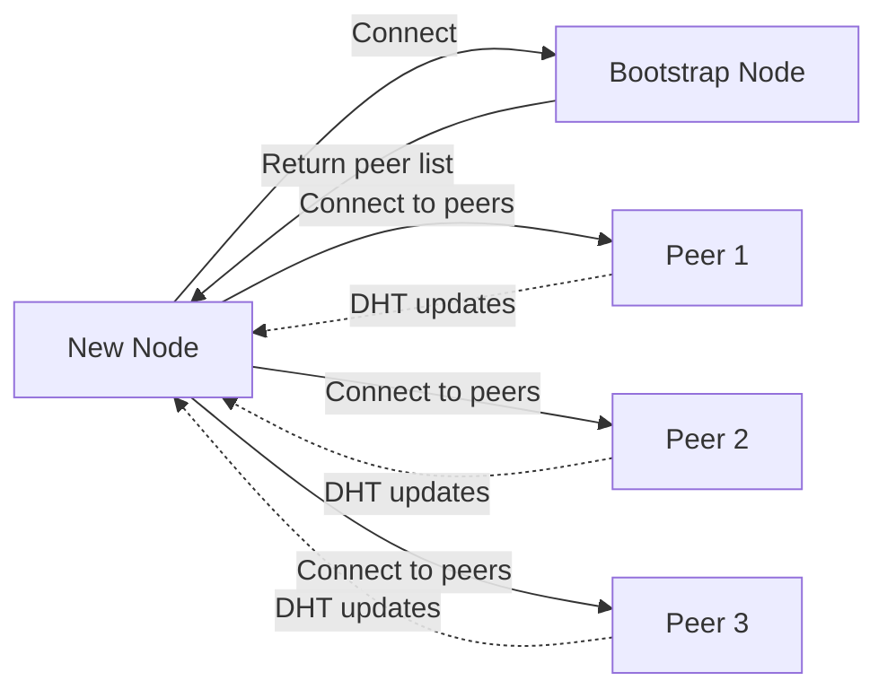

# Bootstrap Node Governance Model: Operational Control and Decentralization

**Document Type:** Operational Recommendation

**Status:** Draft for Discussion

**Date:** 2026-02-16

**Decision needed:** How many boot nodes are necessary for the federated launch and who should operate/coordinate operations?

## What Are Bootstrap Nodes?

### Role in P2P Networks

Bootstrap nodes serve as **directory services** for peer discovery in decentralized networks. The bootnode definition is included in the chain-config for the network and requires a FQDN entry.



**Key Functions:**

1. **Initial Peer Discovery**
   - New nodes connect to bootnodes first
   - Bootnodes return list of known peers
   - Node builds its own peer table via DHT (Kademlia)
2. **Network Entry Point**
   - **Only hardcoded addresses in chain spec**
   - Critical for network accessibility
   - Must be highly available

**Important:** Bootstrap nodes are **not validators**. They don't produce blocks or participate in consensus. They're pure P2P networking infrastructure.

---

## Recommended Hybrid Model

### Tier Structure

**Tier 1: Foundation Core (50-60% of total)**

**Responsibility:** Midnight Foundation
**Number:** 5 nodes
**Purpose:** Guaranteed availability, SLA-backed reliability. Note the specific datacenters and provides are not hard and fast, but rather provided to indicate the need for carrier and operator diversity. Ultimately the set of boot nodes should also be deployed behind load balancer with geographic DNS configuration for best performance. 

| Location       | Provider | Rationale                                |
| -------------- | -------- | ---------------------------------------- |
| US-East-1      | AWS      | Largest cloud region, high availability  |
| US-West-1      | GCP      | Geographic diversity, different provider |
| EU-West-1      | Azure    | GDPR compliance, different provider      |
| EU-Central-1   | Hetzner  | Cost efficiency, European presence       |
| APAC-Singapore | AWS      | Asia-Pacific gateway                     |

**SLA:** 99.9% uptime per node (99.999% aggregate)
**Control:** Foundation has full operational control

---

**Tier 2: Commercial Partners (20-30% of total)**

**Responsibility:** Shielded (or similar commercial partner)
**Number:** 2-3 nodes
**Purpose:** Aligned commercial interests, professional operation

| Location                 | Rationale                         |
| ------------------------ | --------------------------------- |
| Shielded DC-1            | Leverages existing infrastructure |
| Shielded DC-2            | Geographic redundancy             |
| Shielded DC-3 (optional) | Additional capacity if needed     |
| Community Partner 1      |                                   |
| Community Partner 2      |                                   |
| Community Partner 3      |                                   |

**SLA:** 99.5% uptime (contractual)
**Control:** Shielded operational control, Foundation oversight

**Governance:**

- Service Level Agreement (SLA) between Foundation and Shielded/Third Parties
- Performance monitoring by Foundation
- Removal clause if performance degrades
- Clear separation from validator operations (avoid conflicts)

**Operator Selection Criteria:**

1. **Technical Competence**
   - Demonstrated blockchain infrastructure experience
   - 24/7 monitoring and incident response capability
   - Professional-grade hardware and network

2. **Geographic Diversity**
   - Priority for underserved regions (South America, Africa, Middle East)
   - Different jurisdictions than Foundation nodes
   - Diverse infrastructure providers

3. **Community Standing**
   - Active participation in Midnight ecosystem
   - Reputation in broader blockchain community
   - Transparent operations (public metrics)

4. **Financial Sustainability**
   - Able to self-fund operations (or Foundation grants)
   - Not dependent on token speculation
   - Long-term commitment (2+ years)

---

### Geographic Distribution

**Target Distribution (10 total nodes):**

```
North America (3 nodes = 30%)
    ├── US-East-1 (Foundation, AWS)
    ├── US-West-1 (Foundation, GCP)
    └── Canada (Community Partner, optional)

Europe (3 nodes = 30%)
    ├── EU-West-1 (Foundation, Azure)
    ├── EU-Central-1 (Foundation, Hetzner)
    └── Eastern Europe (Community Partner, optional)

Asia-Pacific (2 nodes = 20%)
    ├── Singapore (Foundation, AWS)
    └── Tokyo/Seoul (Shielded or Community Partner)

Middle East / Other (2 nodes = 20%)
    ├── Shielded DC (location TBD)
    └── Community Partner (South America/Africa/Middle East)
```

**Rationale:**

- **North America + Europe:** 60% of blockchain users
- **Asia-Pacific:** Growing market, high traffic
- **Other regions:** Diversity and regulatory resilience

---

### Security Best Practices by Tier

**Tier 1 (Foundation):**

- Hardware Security Modules (HSM) for node keys
- DDoS protection (AWS Shield Advanced)
- Intrusion detection systems (IDS)
- Regular security audits (quarterly)
- 24/7 NOC monitoring
- Incident response team
- Encrypted backups of node keys

**Tier 2 (Community Partner/Shielded):**

- Contractual security requirements (match Tier 1)
- Regular security assessments by Foundation
- Audit logs shared with Foundation
- Incident disclosure agreements
- Foundation can audit infrastructure

