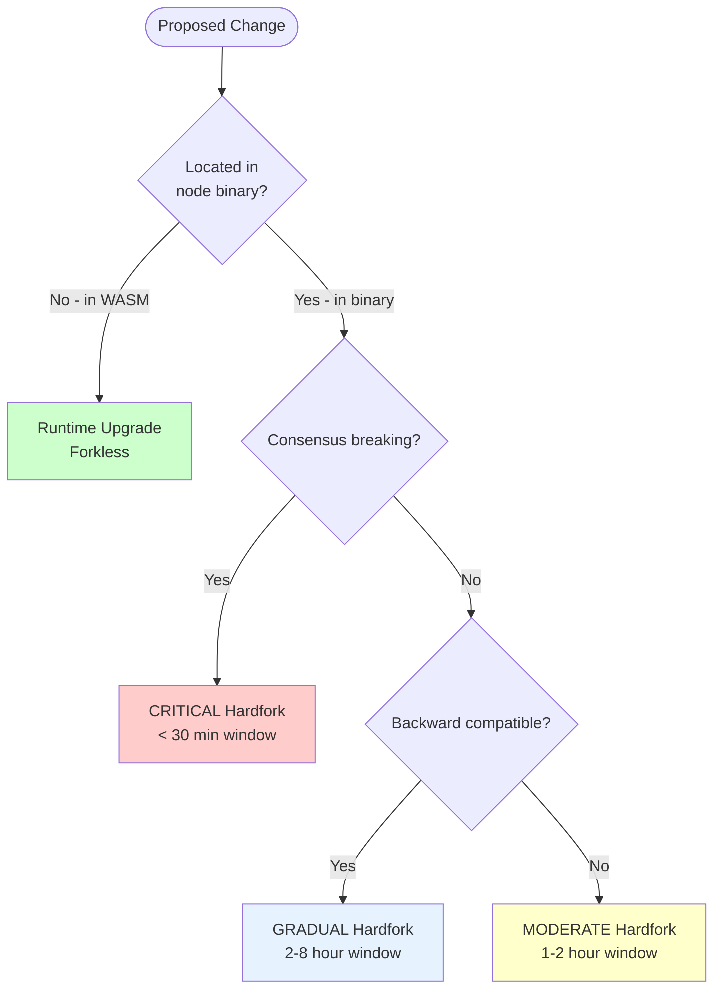
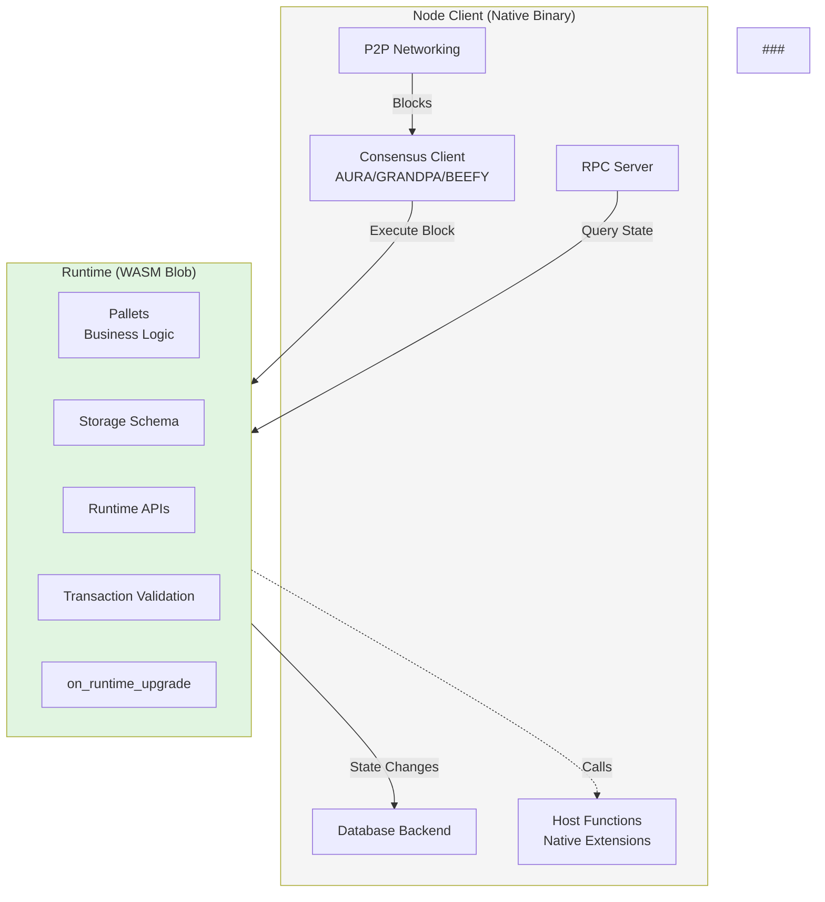

# Midnight Network Upgrade Orchestration Guide

**Version**: 0.4

**Author:** Bob Blessing-Hartley

**Last Updated**: 2026-03-06

**Target Audience**: Federated Node Operators, Network Coordinators, Governance Members

---

## Table of Contents

1. [Executive Summary](#executive-summary)
2. [Understanding Substrate Upgrades](#understanding-substrate-upgrades)
3. [Decision Matrix: Runtime Upgrade vs Hardfork](#decision-matrix-runtime-upgrade-vs-hardfork)
4. [Runtime Upgrades (Forkless)](#runtime-upgrades-forkless)
5. [Hardforks (Coordinated Binary Updates)](#hardforks-coordinated-binary-updates)

---

## Executive Summary

The Midnight blockchain supports two distinct upgrade mechanisms Runtime Upgrades and Hardforks, each suited to different types of changes:

### Runtime Upgrades (Forkless)

**What**: A **runtime upgrade** is Substrate's revolutionary **forkless upgrade mechanism** that allows the blockchain runtime (business logic) to be upgraded **without requiring node restarts or coordinated binary updates**.

**When to use**: Pallet logic, storage schema, transaction formats, ledger versions, ZK circuits, runtime APIs.

### Key Benefits

- No coordination required: Validators do not need to manually update anything

- No downtime: Network continues producing blocks during upgrade

- Automatic application: All nodes automatically apply the new runtime

- On-chain governance: Upgrade approved through democratic/technical committee process

- Rollback capable: Can deploy previous runtime if issues arise

- Testnet validation: Always tested on qanet/preview before mainnet


### Key Differences from Hardforks

| Aspect                 | Runtime Upgrade    | Hardfork                 |
| ---------------------- | ------------------ | ------------------------ |
| Node binary update     | Not required       | Required                 |
| Validator coordination | Not required       | Required (tight timing)  |
| Network downtime       | None               | Possible (1-5 minutes)   |
| Manual intervention    | None               | Required (binary swap)   |
| Deployment mechanism   | On-chain extrinsic | Out-of-band coordination |
| Rollback complexity    | Easy               | Difficult                |
| Risk level             | Low                | Medium-High              |

### Hardforks (Coordinated Binary Updates)

**What**: Breaking changes to node binary requiring simultaneous validator upgrades.

**When to use**: Consensus changes, slot duration, host functions, P2P protocol, database backend.

**Key characteristics**:

- Tight validator coordination required (30-60 minute window)
- Potential network downtime (1-5 minutes)
- Manual binary swap on all validators
- Out-of-band coordination via emergency channels
- Difficult rollback
- Medium-high risk

**Typical timeline**: 4-8 weeks with extensive coordination

---

## Understanding Substrate Upgrades

### Substrate Architecture

```
┌─────────────────────────────────────────────┐
│         Node Binary (Client)                │
│  ╔════════════════════════════════════════╗ │
│  ║  HARDFORK ZONE (Requires Coordination) ║ │
│  ╠════════════════════════════════════════╣ │
│  ║ - Consensus (AURA, GRANDPA, BEEFY)     ║ │
│  ║ - P2P Networking (libp2p)              ║ │
│  ║ - Host Functions (Native Extensions)   ║ │
│  ║ - Block Import Pipeline                ║ │
│  ║ - Database Backend                     ║ │
│  ║ - Slot Duration (Block Time)           ║ │
│  ╚════════════════════════════════════════╝ │
│  ─────────────────────────────────────────  │
│       ↓ Calls WASM Runtime ↓               │
│  ─────────────────────────────────────────  │
│  ╔════════════════════════════════════════╗ │
│  ║  FORKLESS ZONE (Runtime Upgrade)       ║ │
│  ╠════════════════════════════════════════╣ │
│  ║ - Pallets (midnight, cnight, etc.)     ║ │
│  ║ - Business Logic                       ║ │
│  ║ - Storage Schema                       ║ │
│  ║ - Transaction Validation               ║ │
│  ║ - Ledger Logic (ZK proofs)             ║ │
│  ╚════════════════════════════════════════╝ │
└─────────────────────────────────────────────┘
```

**The dividing line**: Changes to the WASM runtime can be deployed forklessly. Changes to the node binary require a hardfork.

### How Runtime Upgrades Work

1. **WASM Compilation**: Runtime compiled to WebAssembly
2. **On-Chain Storage**: Current runtime stored in `:code` system storage key
3. **Upgrade Extrinsic**: `system::setCode(new_wasm)` replaces stored WASM
4. **Automatic Application**: All nodes fetch new WASM from chain state
5. **Migration Hooks**: `on_runtime_upgrade()` runs once in first block
6. **Seamless Execution**: Validators continue producing blocks with new runtime

### How Hardforks Work

1. **Binary Distribution**: New node binary built and distributed to all validators
2. **Coordination**: Validators pre-stage binaries and prepare for synchronized swap
3. **Orchestrated Stop**: All validators stop old binary within narrow time window
4. **Binary Swap**: Validators replace old binary with new one
5. **Synchronized Start**: All validators start new binary together
6. **Network Recovery**: Block production resumes with new binary

---

## Decision Matrix: Runtime Upgrade vs Hardfork

### Quick Reference

| Change Type             | Mechanism       | Coordination      | Example                      |
| ----------------------- | --------------- | ----------------- | ---------------------------- |
| **Pallet logic**        | Runtime Upgrade | None              | Add batch_transfer extrinsic |
| **Storage schema**      | Runtime Upgrade | None              | Add new storage item         |
| **Transaction format**  | Runtime Upgrade | Wallet providers  | New signature type           |
| **Ledger version**      | Runtime Upgrade | Proof server      | v6 → v7 privacy ledger       |
| **ZK circuits**         | Runtime Upgrade | Proof server      | New proving algorithm        |
| **Runtime APIs**        | Runtime Upgrade | None              | New RPC endpoint             |
| **Weight updates**      | Runtime Upgrade | None              | Benchmarking results         |
| **Fee structures**      | Runtime Upgrade | None              | Fee multiplier change        |
| **Host functions**      | **Hardfork**    | Tight (< 30 min)  | New crypto primitive         |
| **Slot duration**       | **Hardfork**    | Exact (< 30 min)  | Block time 6s → 4s           |
| **Consensus algorithm** | **Hardfork**    | Exact (< 30 min)  | AURA → BABE                  |
| **P2P protocol**        | **Hardfork**    | Gradual (2-4 hrs) | Gossip protocol v2           |
| **Database backend**    | **Hardfork**    | Loose (4-8 hrs)   | RocksDB → ParityDB           |

### Decision Flowchart



### Critical Considerations

**Choose Runtime Upgrade when**:

- Change is in WASM runtime (pallets, storage, APIs)
- You want zero downtime
- You need easy rollback capability
- Change can be tested on testnets first

**Choose Hardfork when**:

- Change is in node binary (consensus, networking, database)
- You're modifying host functions
- You're changing slot duration or block time
- Change affects how nodes communicate

**Edge cases**:

- **Transaction version changes**: Runtime upgrade, but coordinate with wallet providers
- **Ledger upgrades with breaking APIs**: Runtime upgrade, but update proof servers first
- **Host function additions**: Hardfork required (or implement in WASM if possible)

---

## Runtime Upgrades (Forkless)



### When to Use

Runtime upgrades handle changes to blockchain business logic:

1. **Ledger Version Upgrades** (Most Common)
   - Upgrading Midnight privacy ledger (v6 → v7)
   - Ledger stored as opaque bytes via StateKey
   - Multiple versions coexist during migration
   - ZK verifying keys bundled with runtime WASM (proving keys distributed separately)

2. **Pallet Logic Changes**
   - New transaction types
   - Modified fee calculations
   - Updated staking rewards
   - New governance features

3. **Storage Migrations**
   - New storage items
   - Schema changes with `on_runtime_upgrade()`
   - Storage version tracking

4. **Transaction Format Changes**
   - New signature schemes
   - Changed extrinsic formats
   - Requires wallet provider coordination

5. **Runtime API Changes**
   - New RPC endpoints
   - Modified query interfaces

6. **Weight Updates**
   - Re-benchmarking results
   - DoS prevention
   - Fee fairness

7. **ZK Circuit Updates**
   - New proving/verification logic
   - Updated ZKIR circuits

---

## Hardforks (Coordinated Binary Updates)

### Definition

A **hardfork** is a breaking change to the Midnight node client software that is **not** included in the runtime WASM and therefore cannot be upgraded via the forkless runtime upgrade mechanism.

### Substrate Architecture Context

```
┌─────────────────────────────────────────────┐
│         Node Binary (Client)                │
│  ╔════════════════════════════════════════╗ │
│  ║  HARDFORK ZONE (Requires Coordination) ║ │
│  ╠════════════════════════════════════════╣ │
│  ║ - Consensus (AURA, GRANDPA, BEEFY)     ║ │
│  ║ - P2P Networking (libp2p)              ║ │
│  ║ - Host Functions (Native Extensions)   ║ │
│  ║ - Block Import Pipeline                ║ │
│  ║ - Database Backend                     ║ │
│  ║ - Slot Duration (Block Time)           ║ │
│  ╚════════════════════════════════════════╝ │
│  ─────────────────────────────────────────  │
│       ↓ Calls WASM Runtime ↓               │
│  ─────────────────────────────────────────  │
│  ╔════════════════════════════════════════╗ │
│  ║  FORKLESS ZONE (Runtime Upgrade)       ║ │
│  ╠════════════════════════════════════════╣ │
│  ║ - Pallets (midnight, cnight, etc.)     ║ │
│  ║ - Business Logic                       ║ │
│  ║ - Storage Schema                       ║ │
│  ║ - Transaction Validation               ║ │
│  ╚════════════════════════════════════════╝ │
└─────────────────────────────────────────────┘
```

A **hardfork** is a coordinated upgrade of the Midnight node binary that requires **simultaneous or near-simultaneous** updates across all validator nodes. Unlike runtime upgrades (which are forkless), hardforks require careful orchestration because:

1. **Network halt risk**: If validators don't upgrade in coordination, the network can split or halt
2. **Consensus compatibility**: Old and new node binaries cannot reach consensus together
3. **No automatic upgrade**: Node binaries must be manually updated by each operator

**What must happen:**

- All validators upgrade within the coordination window (typically 30-60 minutes)

- Clear communication via emergency channels established in advance

- Pre-staged binaries tested and ready on all nodes

- Snapshot backups taken before upgrade (for emergency rollback)

- Go/No-Go decision made by governance before execution

- ## When a Hardfork is Required

  ### Changes That REQUIRE a Hardfork

  | Change Type             | Example                                        | Coordination Window       |
  | ----------------------- | ---------------------------------------------- | ------------------------- |
  | **Slot Duration**       | Changing block time from 6s to 4s              | CRITICAL: < 30 min        |
  | **Host Functions**      | Adding new ZK proof verification host function | MODERATE: 1-2 hours       |
  | **Consensus Algorithm** | Upgrading AURA or GRANDPA                      | CRITICAL: < 30 min        |
  | **P2P Protocol**        | Changing libp2p handshake or protocol ID       | MODERATE: 1-2 hours       |
  | **Block Format**        | Changing block header structure                | CRITICAL: < 30 min        |
  | **Database Backend**    | Switching from RocksDB to ParityDB             | LOW: 4-8 hours            |
  | **Genesis Format**      | Changing initial state structure               | CRITICAL: Network restart |

  ### Critical vs Non-Critical Hardforks

  **CRITICAL (Requires exact coordination):**

  - Slot duration changes
  - Consensus algorithm changes
  - Block format changes
  - **Risk**: Network halt within minutes if not coordinated

  **MODERATE (Requires loose coordination):**

  - Host function additions (with backward compatibility)
  - P2P protocol changes (with version negotiation)
  - **Risk**: Degraded performance, but network continues

  **NON-CRITICAL (Can be rolled out gradually):**

  - Node performance optimizations
  - RPC endpoint additions
  - Database backend changes (with compatible formats)
  - **Risk**: Minimal to none

## Appendix A: Glossary

**General Terms**:

- **Runtime**: WebAssembly blob containing blockchain business logic
- **WASM**: WebAssembly - portable binary format for runtime
- **Host Function**: Native code extension callable from WASM
- **Slot Duration**: Time between blocks (6 seconds for Midnight)

**Runtime Upgrade Terms**:

- **spec_version**: Runtime version, incremented for any change
- **transaction_version**: Transaction format version
- **impl_version**: Implementation version (non-breaking optimizations)
- **system::setCode**: Substrate extrinsic for deploying new runtime
- **on_runtime_upgrade**: Hook executed once with new runtime
- **Migration**: Storage schema transformation during upgrade
- **try-runtime**: Tool for simulating upgrades against live state

**Hardfork Terms**:

- **Coordination Window**: Time frame for synchronized validator upgrades
- **Binary Swap**: Replacing old node binary with new one
- **Chain Split**: Network divergence when validators run incompatible binaries
- **Rollback**: Emergency procedure to restore previous binary

**Governance Terms**:

- **Technical Committee**: Governance body with upgrade authority
- **Sudo**: Superuser account (testnets only)
- **Enactment Period**: Delay between approval and execution
- **Fast-Track**: Accelerated voting for emergencies

**Network Terms**:

- **QAnet**: Internal testing network
- **Preview**: Public-facing testnet
- **Mainnet**: Production network
- **Validator**: Node operator running consensus

### Appendix B: Resources

**Official Documentation**:

- Midnight Docs: https://docs.midnight.network
- Governance Forum: **TO BE DEFINED BY MNF**

Substrate Resources**:

- Substrate Docs: https://docs.substrate.io
- Forkless Upgrades: https://docs.substrate.io/maintain/runtime-upgrades/
- try-runtime: https://docs.substrate.io/reference/command-line-tools/try-runtime/

