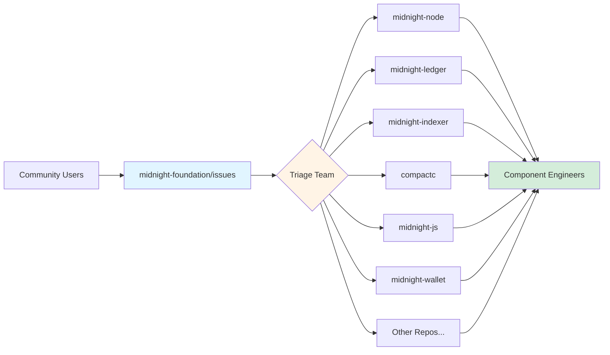
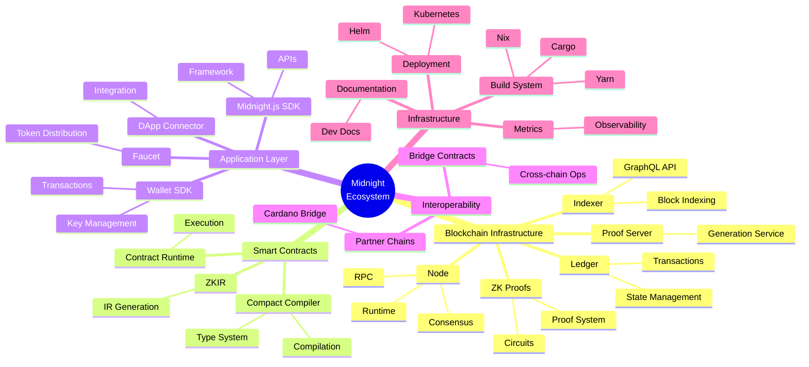
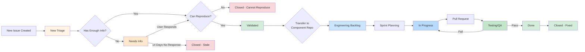
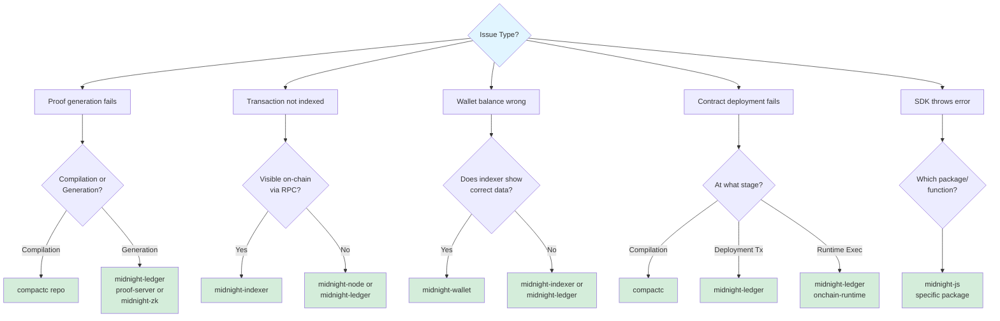
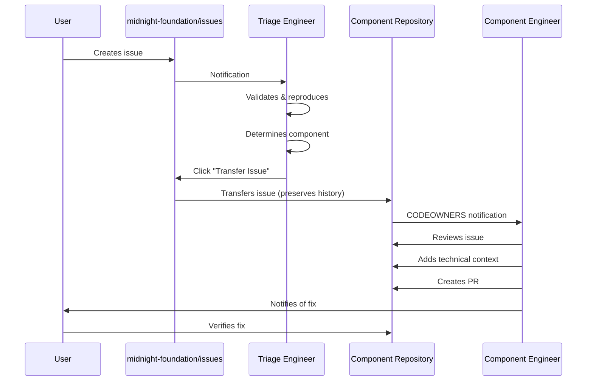
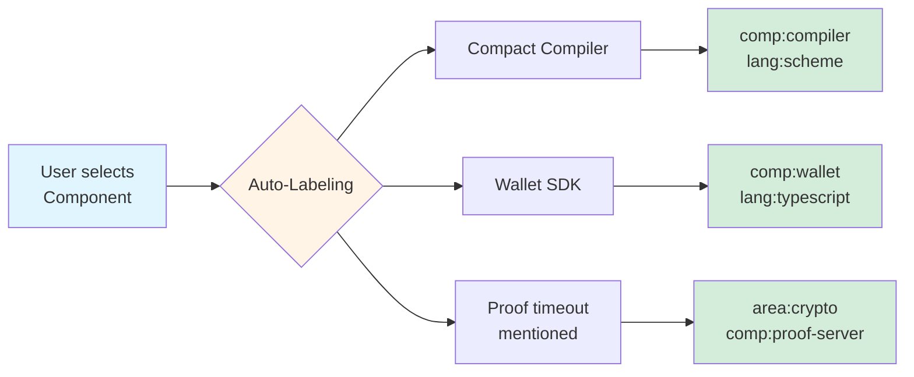
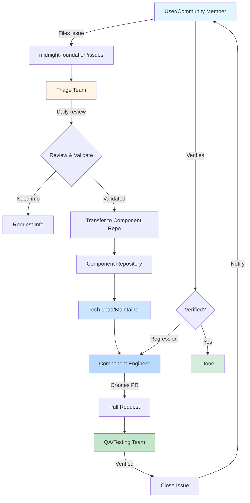
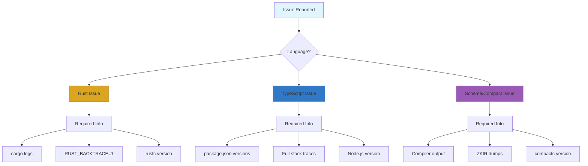
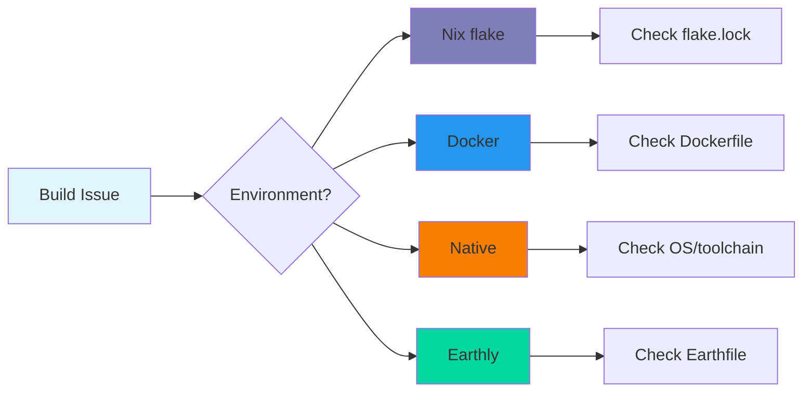
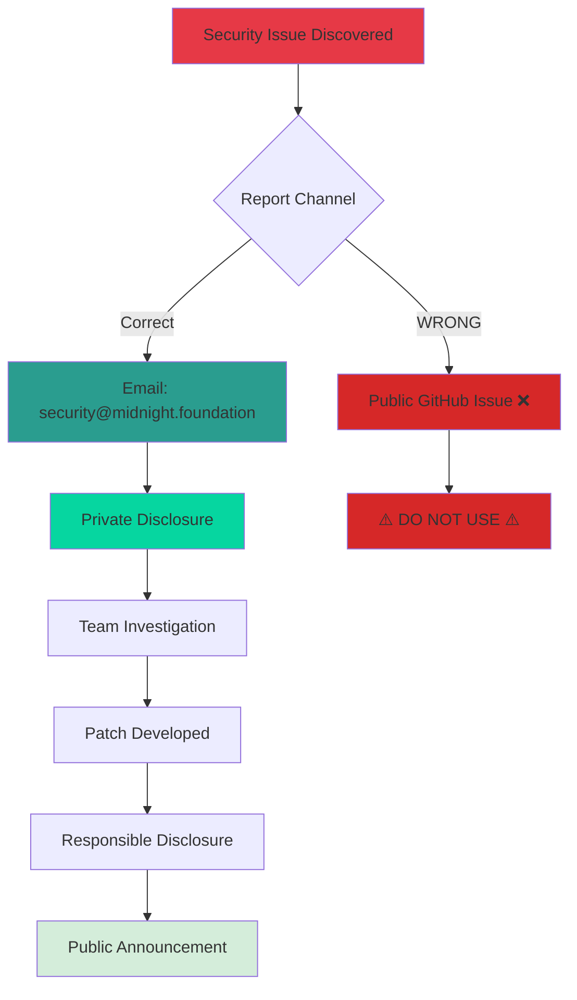

# Issue Triage & Workflow Process - STL/MNF Foundation

## Table of Contents

- [Overview](#overview)
- [The Strategy: The "Catch-All" Funnel](#the-strategy-the-catch-all-funnel)
- [1. Setup: The "Front Door" Repo](#1-setup-the-front-door-repo)
- [2. The Triage Board](#2-the-triage-board-github-projects)
- [3. The Workflow](#3-the-workflow-lather-rinse-repeat)
- [Advanced Automation](#advanced-automation-optional)
- [Roles Summary](#summary-of-roles)

---

## Overview

This document outlines the Midnight Network issue triage and workflow process for the Midnight Foundation team. The goal is to provide a unified, user-friendly intake system that routes issues to the correct component teams while preserving context and maintaining quality.

### Key Principles

1. **Single Entry Point**: All issues come through one repository
2. **No Technical Knowledge Required**: Users don't need to understand the architecture
3. **Preserve Context**: All conversation history follows the issue
4. **Efficient Routing**: Triage team routes to correct component repos
5. **Unified Tracking**: One project board shows all issues across all repos

---

## The Strategy: The "Catch-All" Funnel

The core concept is to create a **single repository specifically for intake**. This acts as your "Help Desk" for the entire Midnight blockchain ecosystem. **No code lives here, only issues.**



---

## 1. Setup: The "Front Door" Repo

### Repository Configuration

This repository! https://github.com/midnightntwork/servicedesk/

**Permissions**: Open to the entire Midnight Foundation team for creating issues.

**Issue Templates**: YAML-based Issue Templates (using GitHub's `.github/ISSUE_TEMPLATE` feature).

### Required Fields

- Expected behavior
- Actual behavior
- Screenshots/logs
- Environment details (OS, versions, network)

**Dropdown asking**: "Which component does this impact?"

### Component Categories



#### Component Breakdown

| Category | Components |
|----------|------------|
| **Blockchain Infrastructure** | • Node (midnight-node) - Consensus, runtime, RPC<br/>• Ledger (midnight-ledger) - Transaction processing, state<br/>• Indexer (midnight-indexer) - Block indexing, GraphQL API<br/>• ZK Proofs (midnight-zk) - Circuit implementation, proof system<br/>• Proof Server - ZK proof generation service |
| **Smart Contracts & Compilation** | • Compact Compiler (compactc) - Smart contract compilation<br/>• ZKIR - Zero-knowledge intermediate representation<br/>• Contract Runtime - On-chain execution environment |
| **Application Layer** | • Midnight.js SDK - TypeScript application framework<br/>• Wallet SDK (midnight-wallet) - Wallet operations<br/>• DApp Connector API - Application integration<br/>• Faucet - Token distribution service |
| **Interoperability & Integrations** | • Partner Chains - Cardano integration toolkit<br/>• Bridge Contracts - Cross-chain operations |
| **Infrastructure & Operations** | • Documentation (midnight-docs) - Developer documentation<br/>• Deployment (midnight-charts) - Kubernetes/Helm<br/>• Metrics & Monitoring - Observability tooling<br/>• Build System - Nix, Cargo, Yarn, Earthly |

### Additional Technical Context Needed

- **Network**: Testnet, Devnet, Localnet, Mainnet
- **Component Versions**: Node version, SDK version, compiler version
- **Build Environment**: Nix, Docker, Native (OS-specific)
- **Language Context**: Rust, TypeScript, Scheme (for Compact)

---

## 2. The Triage Board (GitHub Projects)

**Do not manage this via email notifications.**).

### Board Configuration

**View**: Kanban Board (Github project): MNF-STL-Support

**Columns**:
1. **New Triage** - All new issues land here automatically
2. **Needs Info** - Waiting for user clarification
3. **Validated** - Bug confirmed, ready for component assignment
4. **Engineering Backlog** - Assigned to component teams
5. **In Progress** - Actively being worked
6. **Testing/QA** - Fix ready for validation
7. **Done** - Resolved and closed



### Automation

- Set a workflow so that any new issue created in the repo is automatically added to the "New Triage" column
- Auto-label based on component selection from template
- Auto-assign to component maintainer teams

---

## 3. The Workflow: Lather, Rinse, Repeat

Here is how the Product Manager (PM) and Support team will execute the daily grooming cycle:

### Step 1: Intake (The User)

The user encounters a bug. They go to the issues repo and fill out the form.

#### Example Scenarios

| User Report | Potential Components |
|-------------|---------------------|
| "My proof generation fails with timeout error" | proof-server, midnight-zk, or contract issue |
| "Transaction not appearing in indexer GraphQL API" | node, ledger, or indexer issue |
| "Compact compiler errors on valid syntax" | compactc issue |
| "Wallet shows incorrect balance after transaction" | wallet SDK, indexer, or ledger issue |

**User doesn't need to know the internal architecture** - they just describe what broke and where they saw it break.

**Result**: A new issue appears in the "New Triage" column.

---

### Step 2: The Triage (PO/Support/Technical Triage Team)

**Frequency**: Daily (high priority), Twice weekly (normal priority)

The triage team looks at the "New Triage" column:

#### 1. Initial Assessment

✓ Is this a bug, feature request, or question?
✓ Is there enough information to reproduce?
✓ What component is actually affected?

#### 2. Validation & Reproduction

The triage engineer attempts to reproduce using:
- Local development environment (Nix devshell)
- Docker compose for service-level issues
- Test networks (devnet/testnet) for chain issues
- Relevant test suites (`cargo test`, `yarn test`)

#### 3. Component Determination

Key questions to route issues correctly:



#### 4. Interaction

**If insufficient information**:
- Comment with specific questions using template responses
- Move to "Needs Info" column
- Set 7-day response timer

**If reproduced successfully**:
- Add reproduction steps to issue
- Move to "Validated" column
- Add technical labels (language, subsystem, severity)

#### 5. Labeling Strategy

**Component labels**:
```
comp:node, comp:ledger, comp:indexer, comp:zk, comp:compiler,
comp:sdk-js, comp:wallet, comp:proof-server, comp:faucet,
comp:partner-chains, comp:docs
```

**Language labels**:
```
lang:rust, lang:typescript, lang:scheme, lang:compact
```

**Severity labels**:
- `sev:critical` - Chain halt, data loss, security
- `sev:high` - Major functionality broken
- `sev:medium` - Workaround available
- `sev:low` - Minor inconvenience

**Type labels**:
```
type:bug, type:feature, type:docs, type:performance,
type:security, type:build, type:test
```

**Area labels**:
```
area:consensus, area:rpc, area:storage, area:crypto,
area:compilation, area:runtime, area:api, area:cli
```

---

### Step 3: The Handover (The "Transfer" Feature)

This is the most critical technical step. GitHub has a native **"Transfer Issue"** button on the right sidebar of every issue.

#### Process



#### Component Router

| Issue Component | Target Repository |
|----------------|-------------------|
| Node/Consensus/Runtime | `midnight-node` |
| Ledger/Transactions/ZK | `midnight-ledger` |
| Indexer/GraphQL/Query | `midnight-indexer` |
| ZK Circuits/Proofs | `midnight-zk` |
| Compact Compiler/ZKIR | `compactc` |
| SDK/DApp Framework | `midnight-js` |
| Wallet SDK | `midnight-wallet` |
| Faucet Service | `midnight-faucet` |
| Partner Chains/Bridge | `partner-chains` |
| Documentation | `midnight-docs` |
| Deployment/Infra | `midnight-charts` |

#### What Happens During Transfer

1. Issue physically moves from issues repo to target repo
2. All comments, screenshots, and history are preserved
3. The URL changes, and a redirect is left behind
4. Original submitter is notified of the transfer
5. Component team is auto-notified via CODEOWNERS

---

### Step 4: Engineering Grooming

**Frequency**: Weekly/Bi-weekly per component team

Now the issue exists inside the correct engineering repo.

#### 1. Component Team Review

- Tech lead or maintainer reviews the validated issue
- Assesses effort and complexity
- Determines sprint/milestone assignment
- May request additional technical investigation

#### 2. Technical Context Addition

Engineers add:
- Relevant code pointers (`file:line_number`)
- Related test cases that need updating
- Breaking change assessment
- API/ABI compatibility considerations
- Documentation update requirements

#### 3. Assignment

- PO or tech lead adds priority labels:
  - `priority:critical`, `priority:high`, `priority:medium`, `priority:low`
- Assigns to specific engineer or team
- Moves to "Engineering Backlog" column on unified project board

#### 4. Sprint Planning

- Engineers pick issues from backlog during sprint planning
- Move to "In Progress" when work begins
- Link PRs to issues for automatic tracking
- Move to "Testing/QA" when PR is merged to development branch

#### 5. Verification & Closure

- QA validates fix on appropriate network (devnet/testnet)
- Original reporter is asked to verify if possible
- Issue moves to "Done" and is closed
- If regression, issue is reopened and moved back to "In Progress"

---

## Advanced Automation (Optional)

If our volume gets high, we can use GitHub Actions to assist:

### Auto-Labeling



**Examples**:
- If user selects "Compact Compiler" → auto-apply `comp:compiler`, `lang:scheme`
- If user selects "Wallet SDK" → auto-apply `comp:wallet`, `lang:typescript`
- If user mentions "proof timeout" → auto-apply `area:crypto`, `comp:proof-server`

### Smart Routing

- Parse error messages in issue body
- Match against known error patterns per component
- Suggest target repo for triage engineer

### Stale Bot

- Automatically close issues in "Needs Info" if user hasn't replied in 14 days
- Send 7-day warning before closure
- Allow easy reopening if user responds later

### Version Detection

- Parse version strings from issue body
- Auto-tag with version labels (e.g., `v0.26.0`)
- Flag if version is outdated/unsupported

### Duplicate Detection

- Use GitHub's native duplicate detection
- Suggest similar issues during filing
- Auto-link related issues by error message similarity

### CODEOWNERS Integration

- Automatically request review from component maintainers
- Route to correct Slack/Discord channels by component
- Ensure SLA compliance per component team

---

## Summary of Roles



### Role Breakdown

#### User/Community Member
- Files raw issue in `midnight-foundation/issues`
- Provides environment details and reproduction steps
- Responds to clarification requests
- Verifies fixes when possible

#### Triage Team (PO/Support/Community Managers)
- Daily review of "New Triage" column
- Reproduces bugs and validates reports
- Routes issues to correct component repos
- Manages "Needs Info" follow-ups
- Maintains issue quality and completeness

#### Component Engineers
- Never looks at the issues repo directly
- Reviews issues transferred to their component repo
- Adds technical context and estimates
- Implements fixes and links PRs
- Verifies fixes are complete

#### Tech Leads/Maintainers
- Weekly grooming of component backlog
- Prioritizes issues for sprint planning
- Reviews complex issues requiring architectural decisions
- Ensures cross-component issues are properly coordinated

#### QA/Testing Team
- Validates fixes on appropriate networks
- Runs regression test suites
- Coordinates release testing
- Closes verified issues

---

## Midnight-Specific Considerations

### Multi-Language Stack



**Rust issues**: Require cargo logs, `RUST_BACKTRACE` output
**TypeScript issues**: Need package versions, stack traces
**Scheme/Compact issues**: Require compiler output, ZKIR dumps

### Network-Specific Issues

- Testnet vs Devnet behavior differences
- Partner chain sync issues with Cardano
- Consensus issues affecting validator nodes

### Performance & ZK-Specific

- Proof generation times
- Circuit constraint counts
- WASM performance in browsers
- Memory usage for large state trees

### Build Environment



- Nix flake issues vs native builds
- Docker build failures
- Cross-compilation for WASM targets
- Earthly build reproducibility

### Security Issues

**⚠️ CRITICAL**: Do NOT use public issue tracker for security issues!



**Process**:
- Route privately via `security@midnight.foundation`
- Do NOT use public issue tracker
- Follow responsible disclosure process
- Reference `SECURITY.md` in all repos

---
